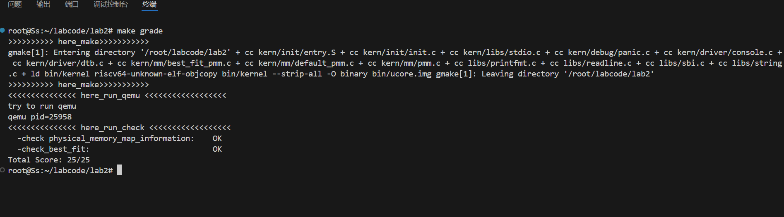
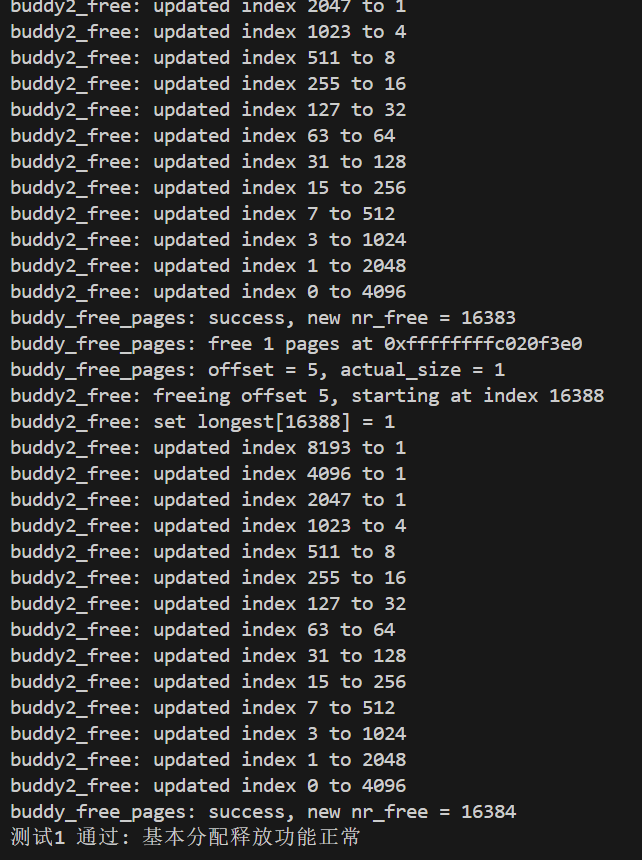
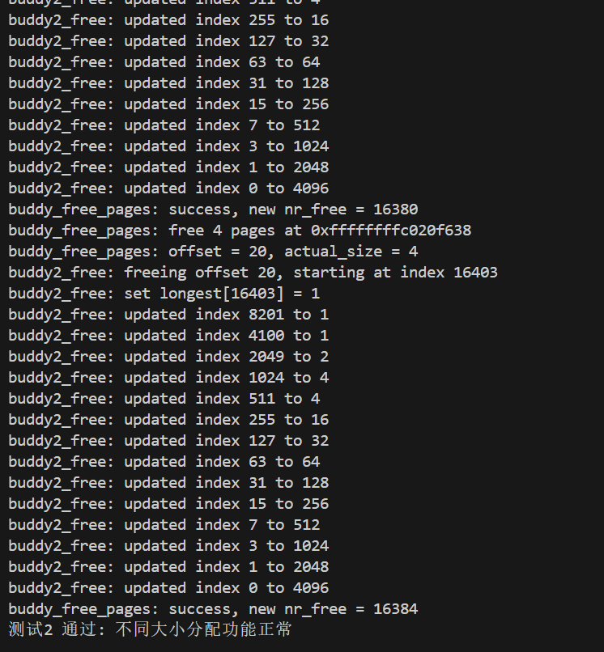
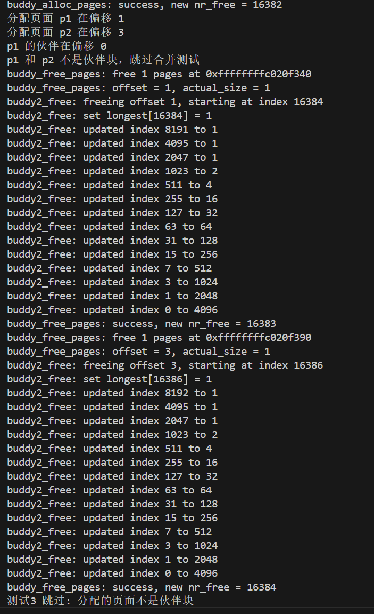
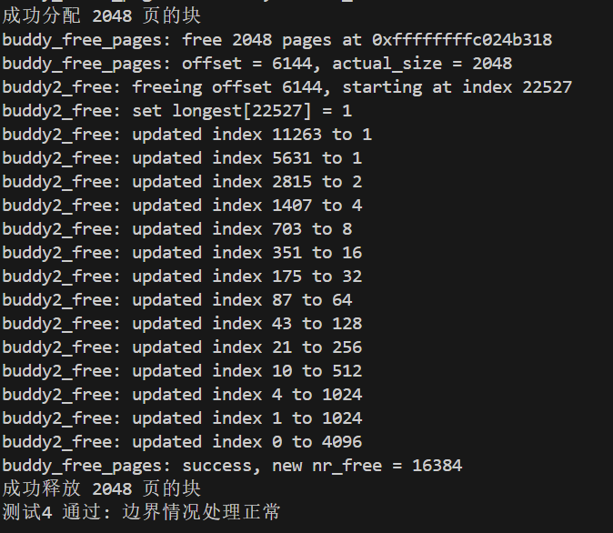
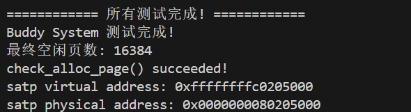

# <center>Lab2 物理内存和页表</center>

<center>石爽 马思远 薄照轩</center>

## 练习1：理解first-fit连续物理内存分配算法（思考题）

### 主要思想

first-fit连续物理内存分配算法维护一个空闲块链表，当需要内存时，找到第一个大小大于所需内存的空闲块分配给进程。

### 实现过程

从空闲内存块的链表上查找第一个大小大于所需内存的块，分配出去，回收时按照地址从小到大的顺序插入链表，并且合并与之相邻且连续的空闲内存块。

### 代码分析

#### default_init

```c
static void default_init(void) {
    list_init(&free_list);
    nr_free = 0;
}
```

该函数用于初始化存放空闲块的链表，调用`list_init`函数初始化双向链表`free_list`，将空闲块个数`nr_free`设置为0。

#### default_init_memmap

```c
static void default_init_memmap(struct Page *base, size_t n) {
    assert(n > 0);
    struct Page *p = base;
    for (; p != base + n; p ++) {
        assert(PageReserved(p));
        p->flags = p->property = 0;
        set_page_ref(p, 0);
    }
    base->property = n;
    SetPageProperty(base);
    nr_free += n;
    // ... 插入到合适位置的代码
}
```

该函数初始化一个空闲内存块，参数`base`指向页面结构体数组起始地址，`n`为页面数量。首先验证页面为保留页面，初始化每个页面的标志和属性，设置首个页面的`property`属性为块总数，更新空闲页数量，并按地址顺序插入链表。

#### default_alloc_pages

```c
static struct Page *default_alloc_pages(size_t n) {
    assert(n > 0);
    if (n > nr_free) return NULL;
    
    struct Page *page = NULL;
    list_entry_t *le = &free_list;
    while ((le = list_next(le)) != &free_list) {
        struct Page *p = le2page(le, page_link);
        if (p->property >= n) {
            page = p;
            break;
        }
    }
    // ... 分配和分割逻辑
    return page;
}
```

该函数分配给定大小的内存块。查找第一个空闲块大小大于n的块，如果块大于所需大小则分割，剩余部分重新加入链表。

#### default_free_pages

```c
static void default_free_pages(struct Page *base, size_t n) {
    assert(n > 0);
    struct Page *p = base;
    for (; p != base + n; p ++) {
        assert(!PageReserved(p) && !PageProperty(p));
        p->flags = 0;
        set_page_ref(p, 0);
    }
    base->property = n;
    SetPageProperty(base);
    nr_free += n;
    // ... 插入和合并逻辑
}
```

该函数释放内存块。重置页面属性，按地址顺序插入链表，并合并相邻的空闲内存块。

### 改进空间

1. **更高效的内存块合并策略**：当前合并策略可以优化
2. **更快速的空闲块搜索算法**：如使用平衡树等数据结构
3. **内存回收策略**：提高内存利用率
4. **更灵活的内存分配策略**：如后续实现的best-fit等算法

## 练习2：实现Best-Fit连续物理内存分配算法（需要编程）

### 实现过程

在`best_fit_alloc_pages`函数中，相比首次适应算法，最佳适应算法遍历整个空闲链表，找到能满足需求且大小最接近的块：

```c
static struct Page *best_fit_alloc_pages(size_t n) {
    assert(n > 0);
    if (n > nr_free) return NULL;
    
    struct Page *page = NULL;
    list_entry_t *le = &free_list;
    size_t min_size = nr_free + 1;
    
    while ((le = list_next(le)) != &free_list) {
        struct Page *p = le2page(le, page_link);
        if (p->property >= n && p->property < min_size) {
            page = p;
            min_size = p->property;
        }
    }
    // ... 分配逻辑
    return page;
}
```

### 设计思路

在分配内存块时，按照顺序查找，遇到比所需内存块大的空闲内存块时，记录当前最小块，继续查询直到找到最小的合适块。释放内存块时，按照顺序插入链表并合并相邻空闲块。

### 测试结果

make qemu编译文件，然后make grade测试，得到以下的结果：



说明程序正确

### 改进空间

1. **时间复杂度优化**：当前O(n)时间复杂度，可使用更高效数据结构
2. **内存碎片管理**：优化小碎片合并策略
3. **预分配机制**：减少频繁分配的开销

## Challenge1：buddy system(伙伴系统)分配算法

## 主要思想

Buddy System算法将系统中的可用存储空间划分为大小为2的n次幂的存储块来进行管理。本实现采用二叉树结构来跟踪内存块的使用状态，通过递归分割和合并操作实现高效的内存分配与回收。

**分配思想：** 当请求内存时，将请求大小向上取整到最接近的2的幂次，然后在二叉树中搜索合适的空闲块。如果当前大小的块不可用，则分割更大的块直到满足需求。

**回收思想：** 释放内存块时，检查其伙伴块是否空闲，如果空闲则合并这两个块，并递归检查更高层的伙伴块，直到无法合并为止。

## 开发文档

### 设计数据结构

采用二叉树结构管理内存块，每个节点记录对应内存块的空闲状态：

```c
typedef struct buddy2 {
    unsigned size;          // 管理的内存总大小（以页为单位）
    unsigned longest[0];    // 柔性数组，存储二叉树节点
} buddy2_t;
```

其中：
- `size`：管理的总内存页数（必须是2的幂）
- `longest`：柔性数组，存储二叉树中每个节点对应的最大空闲块大小

### 核心函数设计

#### 1. 辅助函数

- `IS_POWER_OF_2`：判断是否为2的幂
- `fixsize`：将大小调整为2的幂
- `buddy_manager_size`：计算管理器需要的内存大小
- `get_buddy_simple`：计算伙伴块地址

#### 2. 初始化函数

```c
static buddy2_t* buddy2_new(int size)
```
初始化伙伴系统管理器，构建完整的二叉树结构，所有节点初始化为对应块大小。

#### 3. 分配函数

```c
static int buddy2_alloc(buddy2_t* self, int size)
```
内存分配流程：
1. 将请求大小调整为2的幂
2. 从根节点开始搜索合适的块
3. 如果当前节点大小足够，继续向下搜索更小的块
4. 找到合适节点后标记为已分配
5. 更新父节点的空闲大小

#### 4. 释放函数

```c
static void buddy2_free(buddy2_t* self, int offset)
```
内存释放流程：
1. 计算释放块在二叉树中的位置
2. 恢复节点的空闲大小
3. 向上递归检查伙伴块，如果伙伴也空闲则合并

### 算法核心原理

#### 二叉树结构

使用完全二叉树来管理内存块：
- 根节点管理整个内存区域
- 每个内部节点管理其子节点对应的内存区域
- 叶子节点对应最小的可分配块

#### 伙伴关系

两个块互为伙伴的条件：
1. 大小相同
2. 地址相邻
3. 地址较低块的地址是块大小的整数倍

伙伴块地址计算：`buddy_addr = block_addr ^ block_size`

#### 分配策略

1. **最佳适配**：搜索满足要求的最小块
2. **分割机制**：如果找不到合适大小的块，分割更大的块
3. **递归分割**：直到找到或创建合适大小的块

#### 合并机制

1. **立即合并**：释放时立即检查伙伴块状态
2. **递归合并**：合并后的块继续检查更高层的伙伴
3. **最大化合并**：尽可能合并到最大的连续块

## 测试验证

### 测试框架设计

设计了四个方面的全面测试：

#### 1. 基本分配释放测试 (`buddy_check_basic_allocation`)
- 验证单页分配释放功能
- 检查页面引用计数和属性设置
- 确保基本操作正确性

**测试过程：**
```c
// 分配三个独立页面
p0 = alloc_page();
p1 = alloc_page(); 
p2 = alloc_page();

// 验证独立性
assert(p0 != p1 && p0 != p2 && p1 != p2);

// 释放验证
free_page(p0);
free_page(p1);
free_page(p2);
assert(nr_free_pages() == initial_free);
```


#### 2. 不同大小分配测试 (`buddy_check_different_sizes`)
- 测试1、2、4、8页等不同大小的分配
- 验证块大小调整机制
- 检查块不重叠性

**测试过程：**
```c
// 分配不同大小的块
pages_1 = alloc_pages(1);  // 实际分配1页
pages_2 = alloc_pages(2);  // 实际分配2页  
pages_4 = alloc_pages(4);  // 实际分配4页

// 验证不重叠
assert(pages_1 + 1 <= pages_2 || pages_2 + 2 <= pages_1);
```


#### 3. 伙伴合并功能测试 (`buddy_check_simple_merging`)
- 验证伙伴块识别机制
- 测试合并操作正确性
- 处理非伙伴块情况

**测试过程：**
```c
// 分配两个页面
p1 = alloc_page();
p2 = alloc_page();

// 检查伙伴关系
buddy_of_p1 = get_buddy_simple(p1, 0);
if (p2 == buddy_of_p1) {
    // 执行合并测试
    free_page(p1);
    free_page(p2);
    assert(nr_free_pages() == initial_free);
}
```


#### 4. 边界情况测试 (`buddy_check_edge_cases`)
- 内存不足处理
- 非2的幂大小调整
- 极端大小分配测试

**测试过程：**
```c
// 测试内存不足
large_block = alloc_pages(initial_free + 100);
assert(large_block == NULL);

// 测试大小调整
pages_3 = alloc_pages(3);  // 调整为4页
assert(pages_3->property == 4);
```



### 测试结果分析

#### 内存布局验证

初始状态：
```
初始空闲页数: 16384
buddy system initialized: managing 16384 pages
```

#### 分配过程验证

请求10页时的分割过程：
```
buddy_alloc_pages: request 10 pages, nr_free = 16384
buddy_alloc_pages: adjusted to 16 pages
buddy2_alloc: requesting 16 pages
```

二叉树分割过程：
- 从16384页块开始
- 递归分割为8192、4096、...、16页
- 最终分配16页块

#### 合并过程验证

释放伙伴块时的合并：
```
buddy_free_pages: free 16 pages
buddy2_free: merged at index X, size 32
buddy2_free: merged at index Y, size 64
...
```

递归合并直到恢复大块。

#### 边界情况处理

1. **内存不足**：正确拒绝超额请求
2. **大小调整**：3页请求调整为4页分配
3. **零页请求**：安全处理避免断言失败



## Challenge3：硬件的可用物理内存范围的获取方法（思考题）

### 1. 固件接口查询
- **ACPI表**：解析SRAT、SLIT、MADT表获取内存拓扑
- **UEFI服务**：调用`GetMemoryMap()`获取完整内存映射
- **设备树**：解析`memory`节点获取内存区域信息

### 2. 传统BIOS调用
- **INT 15h, AX=E820h**：获取详细内存映射
- **INT 15h, AX=E801h**：获取扩展内存大小
- **INT 15h, AH=88h**：获取扩展内存基本信息

### 3. 安全内存探测
```c
// 渐进式内存测试算法
for (addr = known_safe_start; addr < max_possible; addr += PAGE_SIZE) {
    save = read(addr);
    write(addr, test_pattern);
    if (read(addr) != test_pattern) break;
    write(addr, save); // 恢复原值
}
```

### 4. 混合探测策略
按优先级尝试：
1. 标准固件接口（ACPI/UEFI/设备树）
2. 传统BIOS调用
3. 保守内存探测
4. 平台特定方法

## 关键原则
- **安全第一**：避免破坏关键数据或导致系统崩溃
- **逐步验证**：从已知安全区域开始探测
- **恢复状态**：测试后恢复内存原状
- **兼容性**：支持多种硬件架构和启动环境